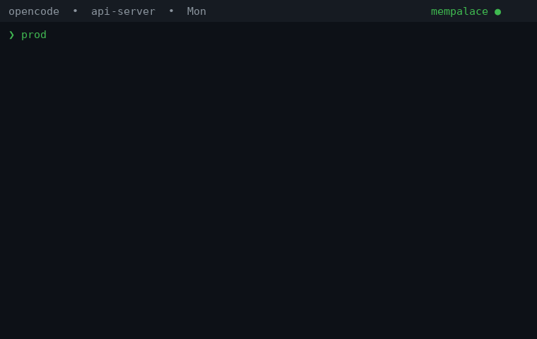

# opencode-mempalace-persistence

> **Community plugin** — not officially maintained by the MemPalace team. Fully open source, ~450 lines of TypeScript.

An OpenCode plugin that automatically saves every conversation to MemPalace and uses stored memory to provide better, context-aware responses. Real-time, zero cron, zero external scripts.

Follows the official MemPalace automation pattern (same as the Claude Code hooks): the plugin decides **when** to save, the model decides **what** to file via the MemPalace MCP tools.

[](https://www.npmjs.com/package/opencode-mempalace-persistence)
[](https://www.npmjs.com/package/opencode-mempalace-persistence)
[](LICENSE)



---

## How it works in 3 seconds

| Without plugin | With plugin |
|---|---|
| Every session starts from scratch | The model knows who you are and what you've done |
| You repeat context each time | Memory is automatic |
| Model starts from scratch each time | Memory persists across sessions |

The plugin injects relevant memories from MemPalace into every prompt (via `experimental.chat.messages.transform`), and saves every response back to MemPalace. A perfect feedback loop.

---

## Installation

### 1. Plugin (saves conversations)

```json
{
  "plugin": ["opencode-mempalace-persistence"]
}
```

Add this line to your `~/.config/opencode/opencode.json` and restart OpenCode.

Works on **OpenCode v1 (>= 1.18.29) and v2** — the package ships a dual
entrypoint (`server()` for v1, `Plugin.define({ id, setup })` for v2), so the
same install works before and after you move to v2. One caveat on v2: the
plugin runs in the server runtime, which has no `tui.showToast`, so TUI
toasts are silent there — `hook.log`, `interactions.log`, `/memory-status`
and `/memory-log` are unaffected.

The transcript export reads **both** database layouts, so a v1 → v2
migration never strands messages: v2 sessions (`session_v2` +
`session_message`, human turn in `data.text`, replies in `data.content[]`)
and v1 sessions (`session` + `message` + `part`) are unioned by session id,
with v2 winning where both exist. Sessions still readable only in the v1
tables (e.g. one created by v1 right before the switch) are exported too.

### 2. Identity (who you are)

Create `~/.mempalace/identity.txt`:

```
I am [name], a [role]. I work with [technologies]. My main projects are [projects].
```

This file is loaded by the plugin — no need to add it to `instructions` in opencode.json.

### 3. MemPalace (if not already installed)

```bash
# Install (requires mempalace>=3.3.5 for HNSW corruption fix)
uv tool install "mempalace>=3.3.5"
# or
pipx install "mempalace>=3.3.5"

# Create palace
mempalace init ~/opencode-memory

# Configure MCP
mempalace mcp
```

The `mempalace mcp` command gives you the exact MCP setup string for your configuration.

### 4. Plugin config (all optional)

No config file is needed to start: every setting has a default, and **not
creating anything means all defaults**. When you want to change one,
create `~/.mempalace/plugin-config.json`:

```json
{
  "autoInjectContext": false,
  "saveInterval": 15,
  "toasts": true
}
```

| Key | Default | What it does |
|---|---|---|
| `autoInjectContext` | `false` | Inject identity + `mempalace search` results into every prompt. Needs no model discipline, but adds context (and noise) to every turn. Off by default: recall happens via the skill instead |
| `saveInterval` | `15` (min `5`) | Human messages between AI checkpoints — same cadence as the official MemPalace save hook |
| `toasts` | `true` | TUI toasts for mines, checkpoints and MemPalace calls. Set `false` to silence them |

**Do NOT put this in `opencode.json`** — OpenCode's schema validation rejects unknown keys. The plugin reads its config from `~/.mempalace/plugin-config.json` instead.

When `autoInjectContext` is enabled:
- **First message**: Injects your identity from `~/.mempalace/identity.txt`
- **Every message**: Runs `mempalace search` and injects relevant results

#### AGENTS.md (minimal — recall lives in the skill)

Create `~/.config/opencode/AGENTS.md`:

```markdown
# Memory & Knowledge instructions

## Recall (via skill, unless auto-inject is on)

Recall follows the bundled `mempalace-recall` skill (question-driven
search). If you enabled `autoInjectContext`, identity + relevant memories
are additionally injected into every prompt — then only search MemPalace
yourself when the question is about past work, decisions, people, or
projects AND the injected context has nothing. Either way, quote results
verbatim, never paraphrase.

## Record facts (after responding, only when something new emerged)

- Durable outcomes (decisions, conclusions, learned facts):
  `mempalace_mempalace_add_drawer`.
- New KG facts: `mempalace_mempalace_kg_add` (128 chars or fewer).
- Changed single-valued fact: `mempalace_mempalace_kg_supersede`.
- Ended fact: `mempalace_mempalace_kg_invalidate`.

Record facts you are confident about. Prefer quality over quantity;
noisy entries degrade retrieval over time. Don't file secrets or tokens.

### Naming reminder
All MemPalace tools use the prefix `mempalace_mempalace_*` (not `mempalace_*`). Examples:
- `mempalace_mempalace_search` (NOT `mempalace_search`)
- `mempalace_mempalace_kg_query`
- `mempalace_mempalace_kg_add`
If you ever catch yourself typing `mempalace_search`, STOP — the correct prefix is `mempalace_mempalace_`.
```

#### Complete `~/.config/opencode/opencode.json`

```json
{
  "$schema": "https://opencode.ai/config.json",
  "plugin": ["opencode-mempalace-persistence"],
  "instructions": ["AGENTS.md"],
  "mcp": {
    "mempalace": {
      "type": "local",
      "command": ["mempalace-mcp"],
      "enabled": true
    }
  }
}
```

> Note: `identity.txt` is NOT listed in `instructions` — the plugin injects it automatically. It is also NOT in the `provider` block or `permission` block — those are optional and depend on your model setup.

#### Recall skill (bundled, Claude-style)

The repo ships `skills/mempalace-recall/SKILL.md` — the question-driven
search-before-answer protocol, adapted from the official MemPalace skill
for OpenCode (including the `mempalace_mempalace_*` tool-prefix note).
Install it where OpenCode loads skills from:

```bash
mkdir -p ~/.config/opencode/skills/mempalace-recall
cp skills/mempalace-recall/SKILL.md ~/.config/opencode/skills/mempalace-recall/
```

The model then loads it on demand whenever a question touches past work,
decisions, people, or projects — same mechanism as the Claude skill.
No AGENTS.md changes needed beyond the minimal block above.

---

## What happens after installation

```
You ask a question
  → Plugin hooks into `experimental.chat.messages.transform`
  → Injects your identity + relevant memories from MemPalace
  → Every ~15 messages: injects a [MemPalace Checkpoint] block
  → Model files topics/decisions/quotes via MCP tools, then answers

The model responds
  → Once the turn completes, the next idle/exit/startup mines it to MemPalace (flat export, no hardcoded wings)
  → Model records new KG facts via MCP tools (only when something new emerged)

Session goes idle / process exits
  → Background mine of everything new since last sync (per-wing cursors:
  each wing advances independently, so one slow wing never stalls the rest)
  → TUI toast confirms what was mined (disable with `"toasts": false`)

Every MemPalace call — plugin searches, model MCP calls (search, diary,
KG) — also raises a short TUI toast with what was asked and a result
preview, so background memory activity is always visible. A startup toast
shows the loaded plugin version (`plugin v2.x loaded`), so you always know
whether you're running the npm release or a local build.

Multiple opencode instances are supported: mines coordinate through the
palace lock with backoff-and-retry (up to ~10min per wing), so concurrent
instances interleave wing by wing instead of starving each other — backfills
complete even with two sessions open. Routine contention shows one info
toast every 5 minutes max. To reduce contention during huge backfills, a
single instance is still fastest.

Compaction starts
  → [MemPalace Pre-Compact Emergency Save]: model files everything first
  → Identity + wake-up context re-attached so the summary cannot lose them

Next time you ask
  → Plugin finds the previous memory → injects it automatically
  → The cycle continues, memory grows
```

---

## What gets saved

Every turn (question + answer) is saved as a drawer in MemPalace. Mining runs with `--mode convos` (default `exchange` extraction: one drawer per exchange pair, verbatim, no paraphrasing). Exports are grouped one wing per project (official multi-project pattern: `bot-oc` sessions land in wing `bot-oc`, never leaking across projects). Only completed turns are exported (in-flight replies are revisited by the next sync). The model additionally records KG facts (decisions, milestones, preferences) during conversation and at each checkpoint via MCP tools.

### Message-level dedup

Each opencode message is exported **exactly once ever**. A message is skipped if its content is either already in the palace (`mined_ids` in `sync_state.json`, recorded when a mine succeeds) or still waiting in the queue. This kills the main duplicate source mempalace's file-level dedup cannot catch — repeated boilerplate (e.g. system prompts re-sent every turn) landing in different export files. (`mempalace dedup` only compares drawers from the *same* source file, so it can't fix that either.)

The "still in the queue" half is **read back from the queue files themselves**, not remembered in the state file. Every export ends with a trailer:

```
<!-- mp-ids: msg_0f1b9…,msg_0f1ba…,msg_0f1bb… -->
```

so the plugin can rebuild the set of queued messages by reading the files. One trailer line per file, not an id per message inline, so the transcript itself stays verbatim.

That choice is deliberate. The obvious alternative — keeping the same ids in `sync_state.json` — drifts the moment anything touches the queue outside the plugin (a manual cleanup, a disk purge, a run killed between write and bookkeeping). A stale set makes the plugin believe a message is queued when its file is gone, and that content is then never exported again: silent, permanent, with no error anywhere. Deriving the set from the files makes that impossible, and deleting a file by hand immediately frees its messages. Cost is one tail read per queued file, once per sync.

A file with no trailer — anything written by 2.x — contributes nothing, which errs toward re-exporting (duplicate memory) rather than losing it.

### Filenames are content-addressed

```
sync_<session-id-prefix>_<sha256-of-transcript[0:12]>.txt
```

The hash covers **only the transcript**, and the filename carries no date and no title. Both were volatile: the same window re-exported on a different day hashed differently and became a *new* file instead of overwriting the old one. That is how one session ended up as three near-identical files in the queue (116 sections, then 137, then 116 again — two of them byte-identical but for the date line).

Nothing is lost by taking them out: title, session and date stay in the file header, and the date is named `Last verified:` because that is what it is — the last time the window was confirmed, rewritten on every re-export. Calling it `Date:` implied a creation date it never had.

A filename has to be a function of the content, or deduplication cannot work at all. It also makes a *growing* window correct: new messages mean a new hash, so a new file, disjoint from the previous one by construction.

### The cursor means "exported", not "mined"

The per-wing cursor advances **when an export file is written**, not when its mine succeeds. That distinction is the whole ballgame:

- The export is cheap and idempotent — same content produces the same filename, so a re-export overwrites itself.
- The mine is expensive and fails for reasons outside the plugin's control (palace lock held by another writer, killed at exit, OOM).

An earlier version advanced the cursor only after a successful mine. A mine that never finished therefore pinned the cursor forever: every later export re-cut its window from the same stale point, and because the session kept growing, each file was a **superset** of the previous one. One long-running session produced 691 overlapping files, and mining them all multiplied every message by up to 691 — 628k drawers, 5 GB, with no error anywhere.

With the cursor on write, windows are always disjoint: the next export starts where the last one stopped. A failed mine loses nothing — **the pending file *is* the queue**, and the next mine picks it up untouched.

The cursor also advances when a window turns out to be *entirely* already in the queue, even though no file was written. Without that, a wing whose window is fully covered would re-read the same messages on every sync forever and never write anything again.

One clamp remains, and it is the residual cause of the 691-file blow-up: if a reply looks in-flight, the cursor is pulled back to just before it, so the next sync re-cuts that window. It is time-bounded (a reply with no new content for 30 minutes is treated as dead and exported as-is), which is why it only bites while something is actively streaming. Combined with content-addressed filenames and the queued-message filter, a re-cut window is now a no-op instead of a new pile of files.

If the queue stops draining (mines blocked or too slow), `hook.log` gets a `WARNING: N exported files waiting to be mined` line, visible in `/memory-status`. Silence there is what hid the blow-up.

Every mine covers every wing with pending files, not just fresh exports: mining fresh-only stranded failures forever (cursor past, never reselected, never retried). On a wing's success the whole directory is deleted and fresh ids plus deleted-file trailers are committed together.

### If you purge the palace by hand

`mined_ids` is a claim about the palace: "this message's content was filed". Delete drawers manually — by `source_file`, by age, whatever — and that claim becomes false while the plugin still believes it, so those messages will not be exported again.

After a manual purge, clear the affected entries from `mined_ids` in `~/.mempalace/sync_state.json`, or delete the whole file to rebuild from scratch (the cost is re-exporting and re-mining recent history, not data loss). Keeping the ids per message rather than per file is what makes a selective repair possible.

### Backfill existing sessions

To mine the full opencode history once (e.g. on first install):

```bash
OPENCODE_MEMPALACE_BACKFILL=1 opencode
```

The plugin exports everything in the opencode database on the next sync, then resumes incremental mode. Mining is idempotent — re-running is safe.

### Durability notes (drawers vs KG)

- **Drawers** (transcripts) are append-mostly: a crash mid-mine can only leave already-filed content behind, never corrupt what's stored. Re-running the mine is always safe.
- **KG facts** live a different life: `kg_supersede` replaces a fact atomically at a shared boundary (single transaction) — a mid-write crash rolls back to the *old* fact: stale but present, never half-written.
- **Reads are validity-window only**: there is no liveness check on read, so a stale fact reads as current until the model revisits it (via checkpoint, diary review, or a new decision on the same subject).
- **Backfill mines transcripts into drawers only** — it never touches the KG. KG facts come exclusively from live MCP calls (conversation, checkpoints, diary). A crashed supersede therefore waits for the next model touch, not the next backfill.

---

## Architecture

```
                 ┌──────────────────────────────┐
                 │         OpenCode              │
                 │                               │
  User msg ─────►│  experimental.chat.messages   │
                 │  .transform hook              │
                 │    ↓                          │
                 │  Injects identity + memories  │
                 │  (autoInjectContext: true)    │
                 │    ↓                          │
                 │  Model sees context → answers │
                 │    ↓                          │
  Answer done ──►│  chat.message (count) + session.idle   │
                 │  mine on idle / exit / startup           │
                 │    ↓                                     │
                 │  Query OpenCode DB (completed turns)     │
                 │    ↓                                     │
                 │  Export → flat text files (0700)         │
                 │    ↓                                     │
                 │  mempalace mine --mode convos            │
                 │  single serialized call                  │
                 └──────────────────────────────────────────┘
                            │
                            ▼
                 ┌──────────────────────────┐
                 │      MemPalace            │
                 │  ~/opencode-memory/       │
                 │  Vector DB + KG           │
                 └──────────────────────────┘
                            ▲
                            │
                 ┌──────────────────────────┐
                 │  Model (via AGENTS.md)    │
                 │  Records KG facts:       │
                 │  kg_add / kg_invalidate  │
                 └──────────────────────────┘
```

---

## Relevant files

| File | Purpose |
|---|---|
| `~/.config/opencode/opencode.json` | OpenCode config with plugin + MCP |
| `~/.config/opencode/AGENTS.md` | Tells the model to manage KG facts |
| `~/.mempalace/plugin-config.json` | Plugin config (`autoInjectContext`, `saveInterval`, `toasts` — all optional, see §4) |
| `~/.config/opencode/skills/mempalace-recall/SKILL.md` | Bundled recall skill (copy from `skills/` in this repo) |
| `~/.mempalace/identity.txt` | Your identity (injected by plugin) |
| `~/.mempalace/hook_state/opencode_counters.json` | Per-session message counters (checkpoint cadence) |
| `~/.mempalace/hook_state/hook.log` | Checkpoint / pre-compact event log (errors always land here) |
| `~/.mempalace/oc-sessions/` | Private (0700) export workspace for pending transcripts |
| `~/.mempalace/config.json` | MemPalace config (palace path) |
| `~/.mempalace/knowledge_graph.sqlite3` | Knowledge Graph (structured facts) |
| `~/opencode-memory/` | MemPalace vector DB (all drawers) |
| `~/.mempalace/sync_state.json` | Per-wing cursors + mined message IDs |
| `~/.mempalace/hook_state/status.json` | One small JSON the TUI status line polls (phase, queue depth, last event) |

---

## Status line in the TUI (OpenCode v2)

The plugin ships a second entry point, `tui.tsx`, that claims the sidebar footer:

```
◆ MemPalace  queue
██████░░░░░░░░░░░░░░░
6 queued · waiting 146h
```

What the bar shows is **queue depth, not progress** — one cell per pending file, capped at 24. It was a percentage at first and that was wrong: there is no real percentage to show (`mempalace mine` is a black box), so an animated 0→100 loop just read as a job stuck at 99%. A progress indicator that lies is the worst possible thing in a memory plugin. While a mine is actually running a `▓▓▓` window sweeps across the bar so activity is visible without inventing a number; idle, the bar is **completely still** and no timer is running.

The third line answers two questions — what is left, and since when — with each clock attached to the thing it measures:

```
13 queued · running for 6m · w2/3 · file 4/10 (ses_f367… 120/300) · +1,240 drawers   a mine is running
9 queued · running for 6m · w1/1 · waiting for palace backed off, lock held
6 queued · waiting 146h                              waiting its turn
6 queued · blocked 146h · palace busy                cannot be written at all
queue empty                                          nothing waiting
```

Per-FILE progress does not come from the mine: the miner walks the files silently (`for i, filepath in enumerate(files, 1)` — it knows, it just never says) and only the final summary reports. It comes from the palace instead: every filed drawer records its `source_file` plus the file's `chunk_total`, so intersecting the wing directory with the filed set tells exactly which files are done and where the current one stands (`120/300` chunks) — with zero mine overhead. A read-only `COUNT(*)` plus one grouped metadata query, polled every 3s while a mine runs. Anything unreadable degrades to elapsed-time-only.

This is also why per-file mine invocations were considered and dropped: they would buy the same detail at ~56s of startup per file (measured: model load is ~1s of it, the rest is two whole-palace prefetch scans that grow with the palace). The detail is free from metadata; the startup cost is not paid.

### The mine outlives opencode

Closing opencode never stops the memory system. On exit the plugin exports what's new and spawns one DETACHED mine per pending wing, then returns immediately — shutdown stays instant no matter how big the backlog is. (The old 45s-budget synchronous mine is gone: it guaranteed failure on any real backlog, 6.6 MB needing 50 minutes.)

Resume is duplicate-free by mempalace's own protocol, not by plugin bookkeeping: every drawer carries its `source_file` plus the file's `chunk_total`, so a mine tells a complete file from one that crashed mid-file (mempalace #2183), purges stale partial drawers, and refiles only what's missing — and drawer ids are deterministic on content, so even a full re-mine overwrites rather than duplicates. Reboot or `kill -9` at any point converges on the next mine. A second close while one is still running exits immediately on the lock and is logged, not an error.

Detached runs are recorded in `~/.mempalace/hook_state/detached-mines.json` (pid, wings, log) with per-wing logs `mine-<wing>-<ts>.log` pruned after 7 days; the next startup reports a still-running predecessor and interleaves via retry.

Two details cost real time to find, both from `packages/plugin/src/host.ts`:

```ts
const specifier = target.name
  ? [target.name, subpath].filter(Boolean).join("/")   // package -> "name/tui"
  : path.resolve(target.directory, subpath || "index") // local dir -> <dir>/tui
```

1. For a **package** (how this ships) the entry must be reachable as `<package-name>/tui`, i.e. declared in this package's `exports` map. For a **local directory** the file must be literally named `tui` — a plain `index.tsx` is never a TUI candidate. (This is also why `server.mjs` exists at the repo root: a local directory resolves its server entry as `<dir>/server` before `<dir>/index`.)
2. **The TUI plugin filesystem is read-only.** A write is refused silently, which is why the direction is one-way: the server plugin publishes `status.json` and this side only polls it. It is also why a `console`/file trace from TUI code is useless for debugging.

Local plugin directories load with `optional: true`, so an import error is skipped with no message anywhere. If a local TUI plugin does nothing, suspect the filename first: it must be `tui.tsx` / `tui.ts` / `tui.js` in a directory (or symlink to one) under `~/.config/opencode/plugins/`.

`tui.tsx` is shipped **uncompiled** on purpose — OpenCode transpiles the TSX and provides the JSX factory, so `@opentui/solid` (14 MB with its Babel toolchain) is not a dependency. The only runtime import is `solid-js`, for the signals that drive the sweep.

## Upgrades are not automatic

OpenCode resolves npm plugins **once** and caches them. A new version of this plugin will not be picked up on its own. To upgrade:

- the TUI's plugin update command, or
- `rm -rf ~/.cache/opencode/npm/opencode-mempalace-persistence@latest` and restart.

Check what is actually loaded with `opencode plugin list`.

---

## Install from npm

```json
{
  "plugin": ["opencode-mempalace-persistence"]
}
```

## Local development

```json
{
  "plugin": ["/path/to/opencode-mempalace-persistence/dist/index.js"]
}
```

## Debug logging

```bash
export OPENCODE_MEMPALACE_DEBUG=1
```

When set, the plugin writes a debug log to `/tmp/opencode-mempalace.log`.

---

## Observability: toasts and commands

Background memory activity is visible three ways — ephemeral first,
history on demand, never polluting session context:

- **TUI toasts** (on by default, `"toasts": false` to disable): mine
  results and errors, armed checkpoints, and every MemPalace call
  (plugin searches and model MCP calls) with what was asked plus a
  short answer preview. A startup toast shows the loaded build
  (`opencode-mempalace-persistence v2.x loaded`), so npm-cache vs
  local build is never a mystery. *(Silent on OpenCode v2 — its server
  runtime has no toast surface; use `/memory-log` there.)*
- **`/memory-status`** — palace health in the transcript: drawers,
  KG stats, last sync, pending backlog, recent activity, errors with
  explanations, active config. Read-only.
- **`/memory-log [N] [filter]`** — the interaction history: every
  search (query → result count), tool call (asked → answered preview),
  mine (outcome per wing) and checkpoint, newest last. Backed by
  `~/.mempalace/hook_state/interactions.log` (JSON lines, auto-rotated).
  Read-only.

---

## License

MIT
